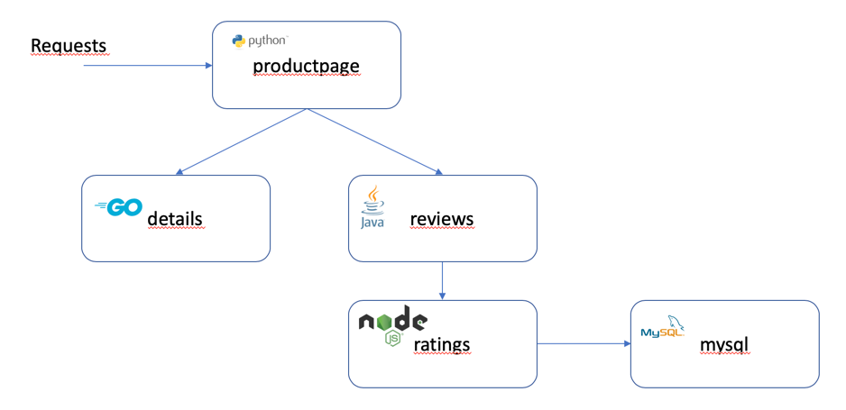

# IBM Cloud App Management demo charts

This is the repository containg artifacts used to install Bookinfo app for demonstrating the capabilities of IBM Cloud App Management.

- [IBM Cloud App Management demo charts](#ibm-cloud-app-management-demo-charts)
  - [Prerequisites](#prerequisites)
  - [Regular helm installation](#regular-helm-installation)
    - [Creating the namespace and imagepolicy](#creating-the-namespace-and-imagepolicy)
    - [Adding helm repo](#adding-helm-repo)
    - [Helm chart installation](#helm-chart-installation)
  - [Installation as helm-based MCM app](#installation-as-helm-based-mcm-app)
  - [Installation as native MCM app](#installation-as-native-mcm-app)
  - [Troubleshooting](#troubleshooting)
  - [References & Useful Links](#references--useful-links)

Bookinfo app is based on sample app from [Istio samples](https://github.com/istio/istio/tree/master/samples/bookinfo)



## Prerequisites

This app to function correctly requires ICAM configuration secret created in a target namespace (bookinfo by default) according to the ICAM Knowledge Center: 

[Obtaining the server configuration information](https://www.ibm.com/support/knowledgecenter/en/SS8G7U_19.4.0/com.ibm.app.mgmt.doc/content/dc_config_server_info.html?cp=SSFC4F_1.2.0)

Go to the ibm-cloud-apm-dc-configpack directory where you extract the configuration package and run the following command to create a secret to connect to the server, for example, name it as icam-server-secret.
```
kubectl -n <my_namespace> create secret generic icam-server-secret \
--from-file=keyfiles/keyfile.jks \
--from-file=keyfiles/keyfile.p12 \
--from-file=keyfiles/keyfile.kdb \
--from-file=keyfiles/ca.pem \
--from-file=keyfiles/cert.pem \
--from-file=keyfiles/key.pem \
--from-file=global.environment
```

## Regular helm installation

### Creating the namespace and imagepolicy
To create a bookinfo namespace and authorize required images with the image policy run the following command:
```
kubectl apply -f prereqs.yaml
```

### Adding helm repo
To add the helm repo as bookinfo-charts run
```
helm init
helm repo add bookinfo-charts https://raw.githubusercontent.com/dymaczew/charts/master/repo/incubator/
```
### Helm chart installation
To install the chart with default values run
```
helm install --name bookinfo --namespace bookinfo bookinfo --set ingress.host=bookinfo.<your_ingress_ip>.nip.io --tls
```
## Installation as helm-based MCM app

To install bookinfo as MCM app you need a cluster with IBM CloudPak for Multicluster Management 1.2

1. Create namespaces **bookinfo-entitlement** and **bookinfo-project**. For Openshift run:
```
oc new-project bookinfo-entitlement
oc new-project bookinfo-project
```
or for IBM Cloud Private run:
```
kubectl create namespace bookinfo-entitlement
kubectl create namespace bookinfo-project
```
2. Create a bookinfo channel:
```
kubectl apply -f bookinfo-channel.yaml
```
3. Create a bookinfo application, subscription and placementrule CRDs:

Edit bookinfo-app.yaml to modify chart version (as of Jan 24, 2020 it's 1.0.8), ingress host name, target namespace and helm release name:

<pre>
spec:
  channel: bookinfo-entitlement/bookinfo-channel
  source: https://raw.githubusercontent.com/dymaczew/charts/master/repo/incubator/ 
  name: bookinfo
  packageFilter:
    version: <b>1.0.8</b>
  placement:
    placementRef:
      name: demo-placementrule
      kind: PlacementRule
  overrides:
  - clusterName: "/"
    clusterOverrides:
    - path: "metadata.namespace"
      value: <b>bookinfo</b>
  packageOverrides:
  - packageName: bookinfo
    packageOverrides:
    - path: spec.releaseName
      value: <b>bookinfo-demo</b>
    - path: spec.values
      value: |
        ingress:
          host: <b>bookinfo.apps.9.30.119.120.nip.io</b>
        details:
          replicaCount: 2
        reviews:
          replicaCount: 3
        ratings
          replicaCount: 1
        productpage
          replicaCount: 2
        mysqldb:
          replicaCount: 1
</pre>

You can customize the number of replicas for each microservice - if you want the smallest footprint change all values to 1. In order to generate slow response time events you can scale mysqldb to 0. 

Apply the configuration with the following command:
```
kubectl apply -f bookinfo-app.yaml
```
This command will automatically install the bookinfo chart to any managed cluster that has label environment=Demo

To change the behavior edit the bookinfo-app.yaml (e.g. to specify the correct ingress.host value for your environment)

## Installation as native MCM app

To install bookinfo as MCM native app you need a cluster with IBM CloudPak for Multicluster Management 1.2

1. Create namespaces **bookinfo-source** and **bookinfo-project**. For Openshift run:
```
oc new-project bookinfo-source
oc new-project bookinfo-project
```

2. Create a bookinfo channel:
```
kubectl apply -f bookinfo-ns-channel.yaml
```
3. Create a bookinfo application, subscription and placementrule CRDs:
```
kubectl apply -f bookinfo-flat-app.yaml
```

## Troubleshooting

[Jan 24th, 2020] In a current version, python data collector embedded in productpage microservice is crashing with error 500 if it cannot find the working icam-server-secret. 


## References & Useful Links

[Create a public Helm chart repository with GitHub Pages](https://medium.com/@mattiaperi/create-a-public-helm-chart-repository-with-github-pages-49b180dbb417)

